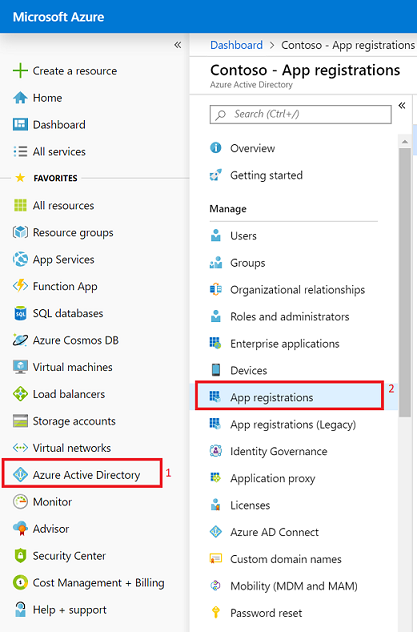
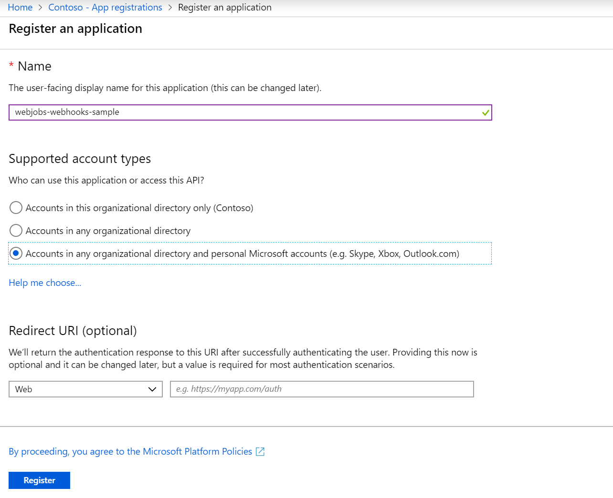

# Microsoft Graph Webhooks sample using WebJobs SDK
Subscribe for [Microsoft Graph webhooks](https://developer.microsoft.com/en-us/graph/docs/api-reference/v1.0/resources/webhooks) to be notified when your user's data changes so you don't have to poll for changes.

This Azure WebJobs sample shows how to start getting notifications from Microsoft Graph. Microsoft Graph provides a unified API endpoint to access data from the Microsoft cloud. 

>This sample uses the Azure AD endpoint to obtain an access token for work or school accounts. The sample uses a application-only permission, however delegated-permissions should also work.

The following are common tasks that an application performs with webhooks subscriptions:

- Get consent to subscribe to users' resources and then get an access token.
- Use the access token to [create a subscription](https://developer.microsoft.com/en-us/graph/docs/api-reference/beta/api/subscription_post_subscriptions) to a resource.
- Send back a validation token to confirm the notification URL.
- Listen for notifications from Microsoft Graph and respond with a 202 status code.
- Request more information about changed resources using data in the notification.

After the app creates a subscription using app-only auth token , Microsoft Graph sends a notification to the registered notification endpoint when events happen in the user's data. The app then reacts to the event.

This sample subscribes to the `Users` resource for `updated` and `deleted` changes. The sample assumes that the notification URL is an [Azure Function](https://docs.microsoft.com/en-us/azure/azure-functions/functions-overview), which listens for webhook over http and immediately adds those notifications to an Azure storage queue. The sample uses [Azure WebJobs SDK](https://docs.microsoft.com/en-us/azure/app-service-web/websites-dotnet-webjobs-sdk) to bind to the Azure storage queue, and receive new notifications as they are queued by the Azure function.

## Prerequisites

To use the Microsoft Graph Webhooks sample using WebJobs SDK, you need the following:

* Visual Studio 2017 installed on your development computer. 

* A [work or school account](http://dev.office.com/devprogram).

* The application ID and key from the application that you [register on the Azure Portal](#register-the-app).

* A public HTTPS endpoint to receive and send HTTP requests. You can host this on Microsoft Azure or another service. This sample was tested using [Azure Function](https://docs.microsoft.com/en-us/azure/azure-functions/functions-overview)

* An Azure storage account that will be used by [Azure WebJobs SDK](https://docs.microsoft.com/en-us/azure/app-service-web/websites-dotnet-webjobs-sdk) 

### Create your app

#### Choose the tenant where you want to create your app

1. Sign in to the [Azure portal](https://portal.azure.com) using either a work or school account.
1. If your account is present in more than one Azure AD tenant:
   1. Select your profile from the menu on the top right corner of the page, and then **Switch directory**.
   1. Change your session to the Azure AD tenant where you want to create your application.

#### Register the app

1. Navigate to the [Azure portal > App registrations](https://go.microsoft.com/fwlink/?linkid=2083908) to register your app.
  
1. Select **New registration**.
  
1. When the **Register an application page** appears, enter your app's registration information:
   1. In the **Name** section, enter a meaningful name that will be displayed to users of the app. For example: `MyWebApp`
   1. In the **Supported account types** section, select **Accounts in any organizational directory and personal Microsoft accounts (e.g. Skype, Xbox, Outlook.com)**.
1. Select **Register** to create the app.
  
1. On the app's **Overview** page, find the **Application (client) ID** value and record it for later. You'll need this value to configure the Visual Studio configuration file for this project.
  
1. In the list of pages for the app, select **Authentication**.
   1. In the **Redirect URIs** section, select **Web** in the combo-box and enter the following redirect URIs:
       - `https://mysigninurl`
    
1. Select **Save**.
1. From the **Certificates & secrets** page, in the **Client secrets** section, choose **New client secret**.
   1. Enter a key description (of instance `app secret`).
   1. Select a key duration of either **In 1 year**, **In 2 years**, or **Never Expires**.
     
   1. When you click the **Add** button, the key value will be displayed. Copy the key value and save it in a safe location.
    
      You'll need this key later to configure the project in Visual Studio. This key value will not be displayed again, nor retrievable by any other means, so record it as soon as it is visible from the Azure portal.
      

1. In the list of pages for the app, select **API permissions**.
   1. Click the **Add a permission** button and then make sure that the **Microsoft APIs** tab is selected.
   1. In the **Commonly used Microsoft APIs** section, select **Microsoft Graph**.
   1. In the **Application permissions** section, make sure that the **Directory.Read.All** permission is checked. Use the search box if necessary.
   1. Select the **Add permissions** button.

1. From the **Manage** page, select **API permissions** > **Add a permission**.

    

1. Choose **Microsoft API** > **Microsoft Graph**.

    

1. Choose **Application permissions**. In the search box, type **directory.read.all** and select the first option from the list. Select **Add permissions**.

    


## Set up Azure function
You must expose a public HTTPS endpoint to create a subscription and receive notifications from Microsoft Graph. You can use Azure Functions for the same.

1. Sign in to the [Azure Portal](https://portal.azure.com/) using your work or school account.

2. Choose **Function Apps** in the left-hand navigation pane.

3. Follow instructions to create a new **Function App**

4. Create a new **WebHook/API** function with following sample code

```csharp
using System.Net;

public static async Task<HttpResponseMessage> Run(HttpRequestMessage req, ICollector<string> queue, TraceWriter log)
{
    log.Info("C# HTTP trigger function processed a request.");

    // parse query parameter
    string validationToken = req.GetQueryNameValuePairs()
        .FirstOrDefault(q => string.Compare(q.Key, "validationToken", true) == 0)
        .Value;
    
    log.Info("validationToken: " + validationToken);

    // Get request body
    string data = await req.Content.ReadAsStringAsync();

    log.Info("Body of request: " + data);

    queue.Add(data);

    log.Info("Added message to queue");

    return string.IsNullOrWhiteSpace(validationToken)
        ? req.CreateResponse(HttpStatusCode.Accepted, "Notification received")
        : req.CreateResponse(HttpStatusCode.OK, validationToken);
}
```

5. Choose **Integrate** > **New Output** > **Azure Queue Storage** 

6. Enter `queue` as **Message Parameter name**

7. Enter `webhooksnotificationqueue` as **Queue name**

8. Use an existing or create a new **Storage account connection**

9. Choose the function created and **Run** from the portal to make sure that it succeeds.

10. Choose on **Get function URL** to copy the notification url to be used in the sample.

## Setup sample project

1. In Solution Explorer, select the **App.config** project.

	a. For the **clientId** key, replace *ENTER_YOUR_APP_ID* with the application ID of your registered Azure application.
	
	b. For the **clientSecret** key, replace *ENTER_YOUR_SECRET* with the key of your registered Azure application.  
	
	c. For the **tenantId** key, replace *ENTER_YOUR_ORGANIZATION_ID* with id of your organization.

	d. For the **webjobs** key, replace *ENTER_YOUR_AZURE_STORAGE_CONNECTION_STRING* with connection string of azure storage integrated in Azure function.
	
	e. For the **notificationurl** key, replace *ENTER_YOUR_NOTIFICATION_URL* with URL of Azure function.

## Use the sample App
1. Press **F5** to start your sample.

2. Wait for sample to print the message **Created new subscription with id:**

3. Update any property of any user in the organization. Example: Update their phone number

4. In a few minutes, sample should receive notification for the updated user along with their identification.

5. Every 30 seconds, sample will renew subscription. One can change the time period of updated operation to be once every 24 hours.

## Key components of the sample

**Controllers**  
- [`Function.cs`](https://github.com/microsoftgraph/webjobs-webhooks-sample/blob/master/WebHooksSample/Functions.cs) Manages subscriptions and Receives notifications.  
- [`Program.cs`](https://github.com/microsoftgraph/webjobs-webhooks-sample/blob/master/WebHooksSample/SubscriptionController.cs) Bootstraps Azure WebJob host.
 
## Troubleshooting

| Issue | Resolution |
|:------|:------|
| You get a 403 Forbidden response when you attempt to create a subscription. | Make sure that your app registration includes the **Read directory data** application permission for Microsoft Graph (as described in the [Register the app](#register-the-app) section). |  
| You do not receive notifications. | Check the logs for Azure function in [portal](https://portal.azure.com/). If Microsoft Graph is not sending notifications, please open a [Stack Overflow](https://stackoverflow.com/questions/tagged/MicrosoftGraph) issue tagged *[MicrosoftGraph]*. Include the subscription ID and the time it was created.<br /><br /> |  
| You get a *Subscription validation request timed out* response. | This indicates that Microsoft Graph did not receive a validation response within the expected timeframe (about 10 seconds).<br /><br />If you created Azure function on **consumption plan** then the function can go to sleep due to inactivity. The sample will try again and should succeed in next attempts. Alternately, try creating Azure function using App service plan. |  
| You get errors while installing packages. | Make sure the local path where you placed the solution is not too long/deep. Moving the solution closer to the root drive resolves this issue. |

<a name="contributing"></a>
## Contributing ##

If you'd like to contribute to this sample, see [CONTRIBUTING.MD](/CONTRIBUTING.md).

This project has adopted the [Microsoft Open Source Code of Conduct](https://opensource.microsoft.com/codeofconduct/). For more information see the [Code of Conduct FAQ](https://opensource.microsoft.com/codeofconduct/faq/) or contact [opencode@microsoft.com](mailto:opencode@microsoft.com) with any additional questions or comments.

## Questions and comments

We'd love to get your feedback about the Microsoft Graph Webhooks sample using WebJobs SDK. You can send your questions and suggestions to us in the [Issues](https://github.com/microsoftgraph/webjobs-webhooks-sample/issues) section of this repository.

Questions about Microsoft Graph in general should be posted to [Stack Overflow](https://stackoverflow.com/questions/tagged/MicrosoftGraph). Make sure that your questions or comments are tagged with *[MicrosoftGraph]*.

If you have a feature suggestion, please post your idea on our [User Voice](https://officespdev.uservoice.com/) page, and vote for your suggestions there.

## Additional resources

* [Microsoft Graph Node.js Webhooks sample](https://github.com/microsoftgraph/nodejs-webhooks-rest-sample)
* [Working with Webhooks in Microsoft Graph](https://developer.microsoft.com/en-us/graph/docs/api-reference/v1.0/resources/webhooks)
* [Subscription resource](https://developer.microsoft.com/en-us/graph/docs/api-reference/v1.0/resources/subscription)
* [Microsoft Graph developer site](https://developer.microsoft.com/en-us/graph/)
* [Call Microsoft Graph in an ASP.NET MVC app](https://developer.microsoft.com/en-us/graph/docs/platform/aspnetmvc)

Copyright (c) 2019 Microsoft Corporation. All rights reserved.
